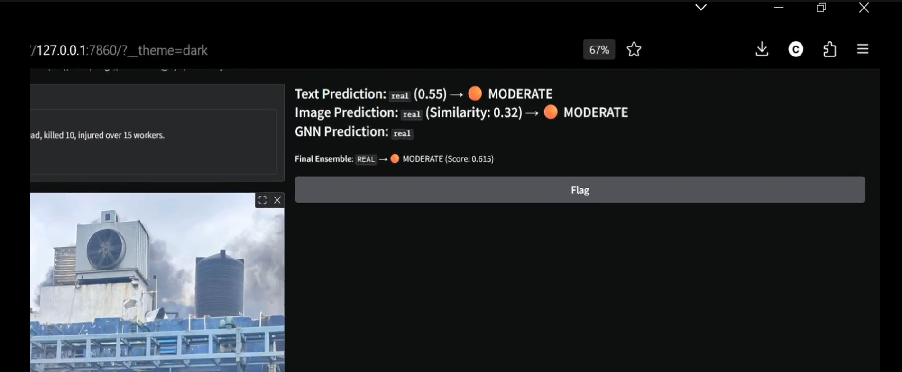

# DisasterMisinformation.AI

**Real-Time Multimodal Disaster Misinformation Detection System**  
This system detects fake or misleading disaster-related tweets using deep learning, graph neural networks, and multimodal ensemble techniques.  
Built to combat misinformation during emergencies using live text, image, and graph propagation signals.

---

## Demo

[](./demo/demo.mp4)

---

## Screenshots


### Gradio UI


### Streamlit Output


---

## What It Does

The system ingests a tweet (text), an optional image, and optional graph data (showing how the tweet spreads), and classifies it as **real or fake** using:

- **DeBERTa** for text stance classification  
- **CLIP** for visual–textual consistency  
- **GNN (GAT/GCN)** for analyzing tweet propagation  
- **Weighted Ensemble** combining all three

Outputs include:  
- Class predictions per modality  
- Confidence scores with interpretation labels (e.g., “HIGH”, “MODERATE”, “LOW”)  
- Final aggregated decision with real-time feedback

---

## Tech Stack

| Layer              | Stack / Tools Used                        |
|--------------------|-------------------------------------------|
| Language Models    | DeBERTa (HuggingFace Transformers)        |
| Vision Models      | CLIP (OpenAI’s vision-language model)     |
| Graph Networks     | GAT, GCN (via PyTorch Geometric)          |
| Interface (UI)     | Gradio, Streamlit                         |
| Deep Learning      | PyTorch, TorchVision                      |
| Graph Processing   | torch_geometric, networkx                 |
| Preprocessing      | Pandas, NumPy, Matplotlib                 |
| Inference/Serving  | Custom pipeline with dynamic loading      |
| Frontend Visuals   | Markdown rendering, basic CSS styling     |
| Data Formats       | .pt graph objects, .csv tweet/image metadata |

---

## Architecture Overview

[ Tweet Text ] ──▶ DeBERTa Model ─┐
│
[ Disaster Image ] ──▶ CLIP Model ├──▶ Ensemble (Soft Voting + Weights) ──▶ Final Prediction
│
[ Graph (.pt) ] ──▶ GNN Model ─────┘


---

## Project Structure

```text
DisasterMisinformation.AI/
│
├── app.py                    # Streamlit-based interface
├── gradio_app.py             # Gradio-based UI (primary demo)
├── gnn_model.py              # GCN/GAT model definitions
├── README.md
├── requirements.txt
├── setup_structure.py
│
├── src/                      # Core inference logic (predict_clip, predict_stance, etc.)
├── models/                   # Saved models (GAT, DeBERTa, etc.)
├── data/                     # Graph files, test CSVs
├── notebooks/                # Exploratory notebooks (training, visualization)
├── scripts/                  # Graph generation, utils
│
├── .env                      # Local secrets/config
├── .gitignore
└── venv/                     # Virtual environment (excluded from GitHub)
```

## How to Run

Install Dependencies

 pip install -r requirements.txt

Launch the App

 Option A: Gradio UI (Recommended)

  python gradio_app.py

 Option B: Streamlit Version

  streamlit run app.py

## Upload Format

    Input Type	Format Supported
    Tweet Text	Freeform natural language text
    Image	.jpg, .png, .jpeg
    Graph File	PyTorch .pt (torch_geometric Data object)

### Example Graph File

    from torch_geometric.data import Data
    import torch
    x = torch.randn((3, 16))  # 3 nodes, 16 features
    edge_index = torch.tensor([[0,1,2],[1,2,0]], dtype=torch.long)
    graph = Data(x=x, edge_index=edge_index)
    torch.save(graph, "graph_test.pt")

## Highlights

    Real-time prediction using cutting-edge models (DeBERTa, CLIP, GNN)

    Modular architecture — works with 1, 2, or all 3 inputs

    Gradio and Streamlit interfaces available

    Ensemble logic improves reliability

    Confidence explanations: HIGH, MODERATE, LOW

## Potential Improvements (Work in Progress)

    Generate GNN graphs from tweet/retweet timelines

    LIME/SHAP explanations for each input modality

    Real-time Twitter API integration

    Hugging Face Spaces or Docker-based deployment

    Visual retweet trees or GNN heatmaps

